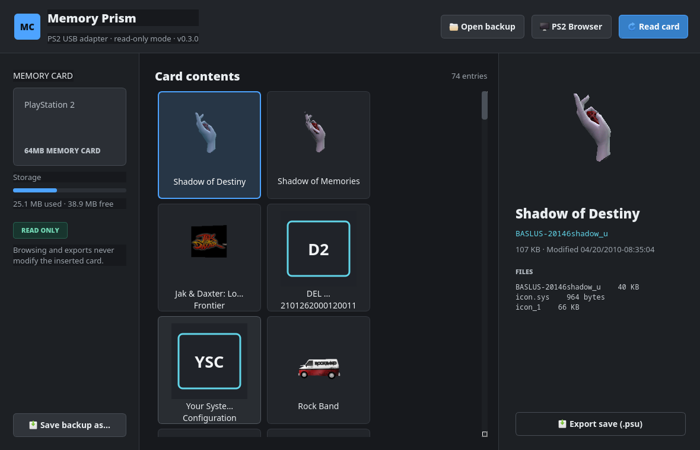

# Memory Prism

**A PS3 PS2 memory card Adapter manager for Linux.**

Memory Prism reads real PS2 memory cards through a compatible PS3 USB memory
card adapter. It combines a practical save manager with a PS2-inspired 3D
browser that renders the textured, animated icon models stored inside the
saves. No PS2 BIOS or emulator is required.




> [!IMPORTANT]
> Adapter access is read-only in v0.3.0. Memory Prism cannot alter or erase a
> physical card.

## Features

- Live browsing without waiting for a complete card image
- Real PS2 save titles, folders, files, sizes, and timestamps
- Textured and animated 3D save icon rendering
- PS2-inspired full-screen icon browser with keyboard and mouse navigation
- Complete `.ps2` memory card backups
- `.psu` export from complete card images
- Browsing of existing `.ps2` backup files without hardware attached
- Support for standard 8 MB cards and tested third-party 64 MB cards
- Automatic card-swap recovery and retry handling for unstable adapters
- Versioned, portable x86-64 AppImage builds

## Supported hardware

The current USB reader targets adapters detected as `054c:02ea`. Development
and testing have primarily used a PowerWave-branded PS3/PS2 memory card
adapter. The official Sony adapter uses the same USB identity and is expected
to be compatible, but needs broader real-hardware testing.

Only PS2 memory cards are supported by the graphical application at present.

## Install the AppImage

1. Download `Memory-Prism-v0.3.0-x86_64.AppImage` from the latest release.
2. Make it executable:

   ```bash
   chmod +x Memory-Prism-v0.3.0-x86_64.AppImage
   ```

3. Run it:

   ```bash
   ./Memory-Prism-v0.3.0-x86_64.AppImage
   ```

If the adapter is found but cannot be opened, install the included USB rule:

```bash
sudo cp udev/60-memory-prism.rules /etc/udev/rules.d/
sudo udevadm control --reload-rules
sudo udevadm trigger
```

Unplug and reconnect the adapter after installing the rule. On distributions
without the `plugdev` group, create it or adjust the group in the rule.

## Use Memory Prism

- Choose **Read card** to browse the inserted card live.
- Choose **Create full backup** to save a complete `.ps2` image.
- Choose **Open backup** to browse an existing card image.
- Choose **PS2 Browser** for the console-inspired 3D view.
- Use the arrow keys or mouse to select icons; press Escape to return.
- Drag the large icon in the card manager to rotate its 3D model.

Card swaps can take a moment while the adapter resets and authenticates the
new card. Keep the adapter connected, change the card, and choose **Read card**
again.

## Run from source

On Ubuntu or Debian:

```bash
sudo apt install build-essential libusb-1.0-0 python3 python3-pip python3-pyqt5
python3 -m venv --system-site-packages .venv
. .venv/bin/activate
pip install -r requirements.txt
./launch.sh
```

`launch.sh` builds the bundled `ps2vmc-tool` helper the first time it is run.

## Build the AppImage

The reproducible build uses an Ubuntu 20.04 container for compatibility with a
wide range of Linux distributions. Install Podman or Docker, then run:

```bash
./scripts/build-appimage.sh
```

The AppImage and its SHA-256 checksum are written to `dist/`. The build
downloads the Ubuntu package index, Python dependencies, and the official
AppImage packaging tool, so an internet connection is required.

## Current limitations

- Physical cards are read-only; write support is not enabled.
- The AppImage currently targets x86-64 Linux.
- Some unusual or malformed save icons may fall back to a static preview.
- Official Sony adapter compatibility has not yet had the same amount of
  hands-on testing as the PowerWave adapter.

## License and trademarks

Memory Prism is released under GPL-3.0. Third-party acknowledgements and
licenses are listed in [THIRD_PARTY_NOTICES.md](THIRD_PARTY_NOTICES.md).

Sony, PlayStation, PS2, and PS3 are trademarks of Sony Interactive
Entertainment. Memory Prism is an independent community project and is not
affiliated with or endorsed by Sony.
